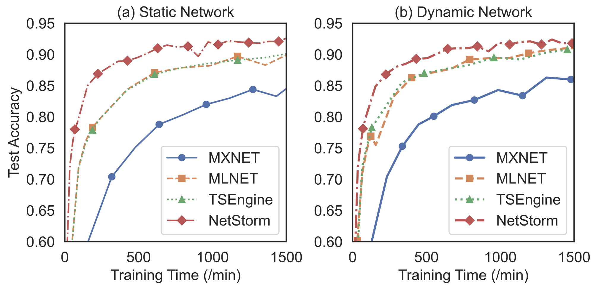

<br>
<p align="center">
  
</p>

The rapid evolution of large-scale AI training has significantly stretched the 
computational, communication, and storage requirements of distributed machine 
learning systems, particularly when deployed over WANs. These systems face 
critical communication bottlenecks due to network constraints such as bandwidth 
scarcity, heterogeneity, dynamics, and frequent large-model data exchanges, 
negatively impacting overall training efficiency. Although previous studies 
have investigated topology optimization, transitioning from a star topology 
to various tree variants, these solutions show limited knowledge about network 
resource availability, making their rigid and static structures fail to adapt 
to network heterogeneity and changes. 

NetStorm is an topology-adaptive and communication-efficient system designed 
for geo-distributed machine learning training. NetStorm realizes an optimized 
*R*-rooted FAPT topology, designed specifically for the unique aggregation mode 
of DML flows. This is supported by a lightweight and precise network awareness 
module that enables NetStorm to perceive and adapt to network conditions more 
effectively. Additionally, NetStorm incorporates a multipath auxiliary routing 
mechanism for more accurate topology decisions and efficient model transmission 
through multipath parallel transmission. With these optimization techniques, 
NetStorm achieves a speedup of 7.5~9.2 times over the standard MXNET system,
and outperforms the other two optimized systems, MLNET and TSEngine.

<p align="center">
  
</p>

# Quick Start
This guide will help you get started with NetStorm in only a few minutes. 
For your convenience, we offer a pre-built Docker image for a quick trial of 
NetStorm. To use this, ensure you have Docker installed by following the
[Docker Guide](https://docs.docker.com/engine/install/ubuntu/).

- Step 1: Pull the Docker image and run a container.

  ```shell
  # To run on CPUs，use:
  sudo docker run -it --rm --name netstorm wenjiaofeng/netstorm:cpu-only bash
  ```

- Step 2: Use the scripts in the scripts folder to launch demo tasks. For example:

  ```shell
  # To run on CPUs，use:
  cd netstorm/scripts/demo && bash muti_server_alexnet.sh
  ```

# Deploy NetStorm on Klonet
NetStorm can also be deployed on the Klonet platform. Klonet is a network 
emulation platform for the technology innovation. It is designed to support 
the development and testing of new network protocols and applications in a 
realistic environment. Klonet can emulate various network scenarios, such as 
wireless, mobile, satellite, and optical networks, and provide fine-grained 
control over the network parameters, such as bandwidth, delay, jitter, and 
packet loss. Klonet can also integrate with real devices and applications, 
such as routers, switches, sensors, and smartphones, to create hybrid network 
experiments. Klonet is based on the Linux operating system and uses 
virtualization and containerization technologies to create isolated network 
nodes and links. Klonet also provides a graphical user interface and a 
command-line interface for users to configure and manage their network experiments.

> WARN: Unfortunately, Klonet is not open source at the moment. We appreciate 
> your patience and look forward to its open source release.

- Step 1: Start platform services.

  ```shell
  # 1. Start rabbitmq-server
  sudo docker start rabbitmq-server
  
  # 2. Start redis-celery
  sudo docker start redis-celery
  
  # 3. Start mysql-vemu
  sudo docker start mysql-vemu
  
  # 4. Start registry
  sudo docker start registry
  ```

- Step 2: Start redis (port 8368).

  ```shell
  # 1. Start the redis database (8368)
  cd /root/vemu_install_new_gen/install_redis/  # Switch to the directory of the configuration file redis.conf
  /usr/local/bin/redis-server redis.conf &
  
  # 2. Check if redis (8368) is working properly
  redis-cli -p 8368 # Specify the port connection
  127.0.0.1:8368 > auth vessalius # Test if redis is working properly
  
  # 3. PS: When testing redis (6379) in the same way as in step 2, you may encounter the problem of needing to configure a password for redis-celery (6379), follow the steps below, and then test it again as in step 2
  redis-cli -p 6379
  127.0.0.1:6379 > config set requirepass vessalius
  ```

- Step 3: Start the service process.

  ```shell
  # 1. Switch to the same level directory as the job vemu_usetc
  cd /home/homan/vemu_wudx/wudx/wu_for_ML
  
  # 2. Start master_gunicorn
  screen -S wudx_master
  sudo /usr/local/python3/bin/gunicorn -c gun.py master_main:flask_app
  (Use Ctrl + A + D to exit screen)
  
  # 3. Start celery
  screen -S wudx_celery
  sudo /usr/local/python3/bin/celery -A celery_worker.celery worker --loglevel=info
  (Use Ctrl + A + D to exit screen)
  
  # 4. Start data_server
  screen -S wudx_data_server
  sudo /usr/local/python3/bin/gunicorn -c data_server_gun.py data_server_main:flask_app
  (Use Ctrl + A + D to exit screen)
  
  # 5. Start web_terminal_main
  screen -S wudx_web_terminal
  sudo python3.8 web_terminal_main.py
  (Use Ctrl + A + D to exit screen)
  
  # 6. Start worker gunicorn
  screen -S wudx_worker1
  sudo /usr/local/python3/bin/gunicorn -c worker_gun.py worker_main:flask_app
  (Use Ctrl + A + D to exit screen)
  ```

- Step 4: Set up physical network topology.

  ```shell
  # 1. If previous topology exists, delete it
  python klonet_destroy_topo.py
  
  # 2. Set up the network topology
  python klonet_deploy_topo.py
  
  # 3. Port mapping
  python klonet_mapping_port.py
  
  # 4. Update script name correspondences, including：
  python klonet_net_dynamic.py
  bash klonet_sync_lib.sh
  bash klonet_sync_app.sh
  ```

- Step 5: Enable Dynamic Networks.

  ```shell
  # Start the speed limit script: (make sure it's always running in the background)
  python klonet_net_dynamic.py
  ```

- Step 6: Automating the source code synchronization and compilation process.

  ```shell
  # 1. Source compilation
  bash klonet_sync_works.sh
  # 2. Source sync
  bash klonet_sync_lib.sh
  # 3. ts-mxnet-app sync
  bash klonet_sync_app.sh
  ```

## Cite Us
Our paper is currently undergoing a blind review. We appreciate your patience and will 
update the paper information once it has been accepted.